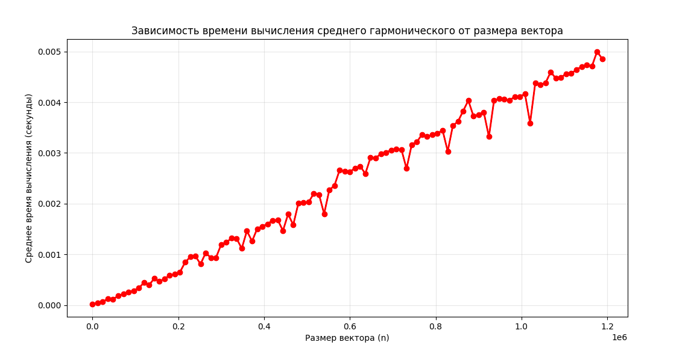

Лабараторная работа №1.

Игнатьев С.П ИУ10-36

Задание 1.2


```python
import numpy as np
import time
import matplotlib.pyplot as plt
from statistics import mean


N = 12  
max_n = 10**5 * N  
step = 1000 * N  
num_runs = 5  


n_values = []
times = []


for n in range(1, max_n + 1, step):
    
    
    v = np.random.rand(n)
    print(f"Обрабатывается n = {n}")
    run_times = []
    
    
    for run in range(num_runs):
        
        start_time = time.time()
        
       
        total_sum = np.sum(v)
        
        end_time = time.time()
        run_times.append(end_time - start_time)
    
    
    n_values.append(n)
    times.append(mean(run_times))


plt.figure(figsize=(12, 6))
plt.plot(n_values, times, 'ro-', linewidth=2, markersize=6)
plt.xlabel('Размер вектора (n)')
plt.ylabel('Среднее время вычисления суммы (секунды)')
plt.title('Зависимость времени вычисления суммы элементов от размера вектора)')
plt.grid(True, alpha=0.3)
plt.show()
```


Заданеи 1.5


```python
import numpy as np
import time
import matplotlib.pyplot as plt
from statistics import mean


N = 12 
max_n = 10**5 * N 
step = 1000 * N  
num_runs = 5

n_values = []
times = []


for n in range(1, max_n + 1, step):
    
    v = np.random.rand(n)
    print(f"Обрабатывается n = {n}")
    run_times = []
    

    for run in range(num_runs):

        start_time = time.time()
        
        max_value = np.max(v)
        
        end_time = time.time()
        run_times.append(end_time - start_time)
    
    n_values.append(n)
    times.append(mean(run_times))


plt.figure(figsize=(12, 6))
plt.plot(n_values, times, 'ro-', linewidth=2, markersize=6)
plt.xlabel('Размер вектора (n)')
plt.ylabel('Среднее время поиска максимума (секунды)')
plt.title('Зависимость времени поиска максимального значения от размера вектора')
plt.grid(True, alpha=0.3)
plt.show()
```


Задание 1.6


```python
import numpy as np
import time
import matplotlib.pyplot as plt
from statistics import mean


N = 12  
max_n = 10**5 * N
step = 1000 * N 
num_runs = 5


n_values = []
times = []

for n in range(1, max_n + 1, step):
    
    v = np.random.rand(n)
    print(f"Обрабатывается n = {n}")
    run_times = []
    
    for run in range(num_runs):
        start_time = time.time()
        
        min_value = np.min(v)
        
        end_time = time.time()
        run_times.append(end_time - start_time)

    n_values.append(n)
    times.append(mean(run_times))

plt.figure(figsize=(12, 6))
plt.plot(n_values, times, 'ro-', linewidth=2, markersize=6)
plt.xlabel('Размер вектора (n)')
plt.ylabel('Среднее время поиска минимума (секунды)')
plt.title('Зависимость времени поиска минимального значения от размера вектора')
plt.grid(True, alpha=0.3)
plt.show()
```


```python

```


Задание 1.8


```python
import numpy as np
import time
import matplotlib.pyplot as plt
from statistics import mean

N = 
max_n = 10**5 * N  
step = 1000 * N
num_runs = 5

n_values = []
times = []
for n in range(1, max_n + 1, step):
    
    v = np.random.rand(n) + 0.001  
    print(f"Обрабатывается n = {n}")
    run_times = []
    

    for run in range(num_runs):

        start_time = time.time()
        
        harmonic_mean = len(v) / np.sum(1.0 / v)
        
        end_time = time.time()
        run_times.append(end_time - start_time)
    
    n_values.append(n)
    times.append(mean(run_times))

plt.figure(figsize=(12, 6))
plt.plot(n_values, times, 'ro-', linewidth=2, markersize=6)
plt.xlabel('Размер вектора (n)')
plt.ylabel('Среднее время вычисления (секунды)')
plt.title('Зависимость времени вычисления среднего гармонического от размера вектора')
plt.grid(True, alpha=0.3)
plt.show()
```


```python

```




```python

```

Задание 2


```python
import numpy as np
import time
import matplotlib.pyplot as plt
from statistics import mean


N = 12  
max_n = 10**2 * N  
step = 1*N  
num_runs = 5  


n_values = []
times = []


for n in range(1, max_n + 1, step):
    
   
    A = np.random.rand(n, n)
    B = np.random.rand(n, n)
    print(f"Обрабатывается размер матрицы = {n}x{n}")
    run_times = []
    
  
    for run in range(num_runs):
        start_time = time.time()
        
        C = np.dot(A, B)
        
        end_time = time.time()
        run_times.append(end_time - start_time)
    
    n_values.append(n)
    times.append(mean(run_times))


plt.figure(figsize=(12, 6))
plt.plot(n_values, times, 'ro-', linewidth=2, markersize=6)
plt.xlabel('Размер матрицы (n x n)')
plt.ylabel('Среднее время умножения матриц (секунды)')
plt.title('Зависимость времени умножения матриц от их размера')
plt.grid(True, alpha=0.3)
plt.show()

```


```python

```
